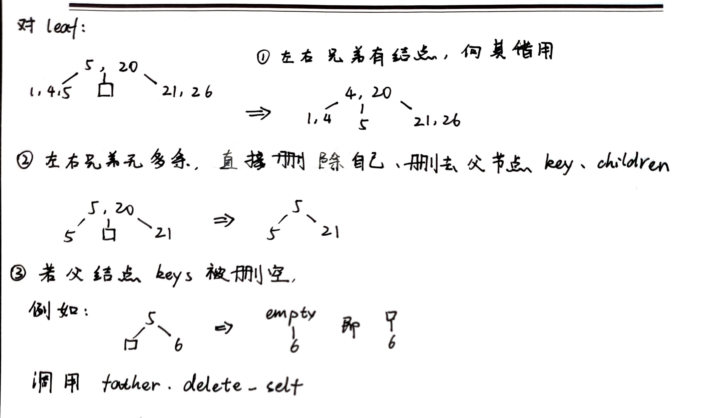
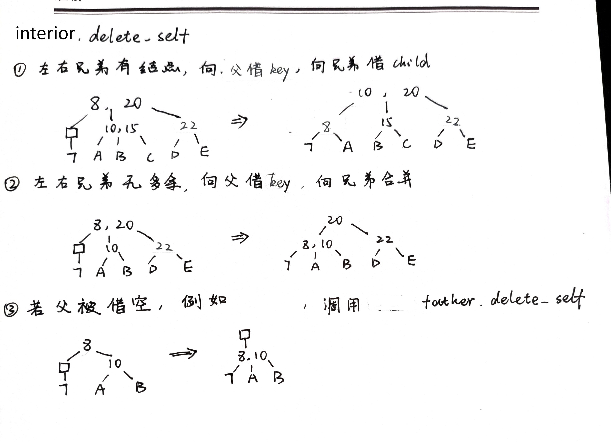

# B+ Tree Document

非常棒的在线工具：[B+ Tree Visualization (usfca.edu)](https://www.cs.usfca.edu/~galles/visualization/BPlusTree.html)

实在是救我狗命

网上有关 B+ tree 的文章很多，但很少能完全给出实现细节，这篇文章就其实现细节做粗略记录，和代码 BPlusTree.java 相互照应。

我在实现时没有参考任何其他 B+ tree 实现代码，不保证其最优性，不保证严格满足教科书中 B+ tree 的定义，但保证实现的B+ tree 作为一个排序树的所有性质，并且通过洛谷上的一道[平衡树模板题](https://www.luogu.com.cn/problem/P3369)完成正确性验证。

## 基本思想

网上资料很多，不在赘述。这里使用的 B+ tree 限制每个节点最多包含 m 个 key。不限制最少 key 数量。

## 插入时的节点分裂

插入节点时，可能需要分裂节点。分裂策略对于叶子结点、内部节点是基本相同的，除了在叶子节点需要复制 value 值、维护叶子节点的双向链表，而内部节点需要复制 children 的值。

在叶子节点插入 (key, value) 前，先检查当前节点 keys 能否容纳下插入的值，如果能容纳，直接插入，否则先分裂叶子节点。

在节点分裂时，使用 PseudoInterior 节点维护节点刚刚分裂，但还未调整 B+ tree 树形态时的信息。PseudoInterior 作为一个”虚假的“内部节点，之后会调用 Interior 节点的 insert 方法完成树形态调整。

PseudoInterior 包含信息如下：

* left、right：分裂后得到的两个节点，可以是 interior node 也可以是 leaf node
* key

当前节点分裂后，检查父节点 keys 是否能容纳新的 key，若能，调用父节点的 insert 函数依托刚才得到的 PseudoInterior 调整树形态。

负父节点 keys 容量已满，则调用父节点的 split，然后再插入 PseudoInterior node.

综上，insert 函数总是假设当前节点容量充足，能够直接容纳新插入的值，并且

* 对于 leaf：插入的是 (key, value)
* 对于 interior：插入的是 PseudoInterior

split 函数分裂当前节点，并且得到一个 PseudoInterior，函数流程如下：

* 若父节点容量已满，则：
  * 调用父节点 split
* 分裂当前节点，构造 PseudoInterior
* 调用父节点 insert 函数，插入刚构造的 PseudoInterior

## 删除节点

对于叶子节点：

对于内部节点：

剩下的就是处理一下根节点变化。

